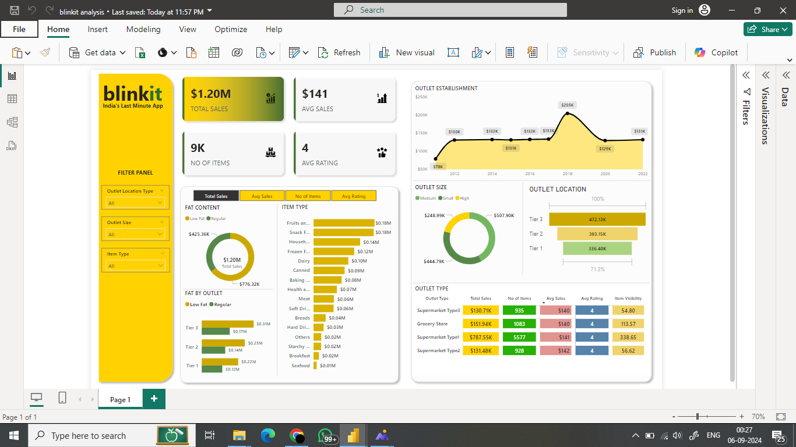

# Blinkit Sales Analysis Dashboard

## Overview

This project aims to conduct a comprehensive analysis of Blinkit's sales performance, customer satisfaction, and inventory distribution. Using Power BI, the dashboard provides key insights and visualizations, helping identify optimization opportunities across various outlets. Key performance indicators (KPIs) such as total sales, average sales, number of items sold, and customer ratings are analyzed.

## Dashboard Preview

Below is a preview of the Blinkit Sales Analysis Dashboard:

## Key Features

### Business Requirements
The dashboard addresses the following business needs:
1. **Total Sales**: Overall revenue generated.
2. **Average Sales**: Average revenue per sale.
3. **Number of Items Sold**: Total count of items sold.
4. **Average Customer Rating**: Average customer rating for the items sold.

### Data Visualizations
The following visualizations have been developed to analyze Blinkit's performance:
1. **Total Sales by Fat Content (Donut Chart)**: Analyze how fat content influences total sales, along with other KPIs.
2. **Total Sales by Item Type (Bar Chart)**: View the performance of various item types based on total sales.
3. **Fat Content by Outlet for Total Sales (Stacked Column Chart)**: Compare fat content across outlets and its effect on sales.
4. **Total Sales by Outlet Establishment**: Examine the influence of outlet type or age on total sales.
5. **Sales by Outlet Size (Donut/Pie Chart)**: Analyze sales based on the size of the outlet.
6. **Sales by Outlet Location (Funnel Map)**: Assess the geographic distribution of sales across locations.
7. **All Metrics by Outlet Type (Matrix Card)**: Provide a holistic view of all KPIs across different outlet types.

## Steps Followed in the Project

1. **Requirement Gathering**: Understanding the business requirements and defining KPIs.
2. **Data Walkthrough**: Reviewing the dataset for relevant information.
3. **Data Connection**: Connecting to the dataset in Power BI.
4. **Data Cleaning / Quality Check**: Ensuring data accuracy and completeness.
5. **Data Modeling**: Structuring the data for effective analysis.
6. **Data Processing**: Processing the data to prepare it for analysis.
7. **DAX Calculations**: Implementing necessary DAX calculations for KPI metrics.
8. **Dashboard Layout and Design**: Structuring the layout for easy user interaction.
9. **Charts Development**: Building visualizations for insights generation.
10. **Insights Generation**: Deriving insights from the visualizations and KPIs.

## Tools and Technologies Used

- **Power BI**: For data visualization and analysis.
- **DAX**: For performing calculations on data models.
- **Data Source**: Blinkit sales data.

